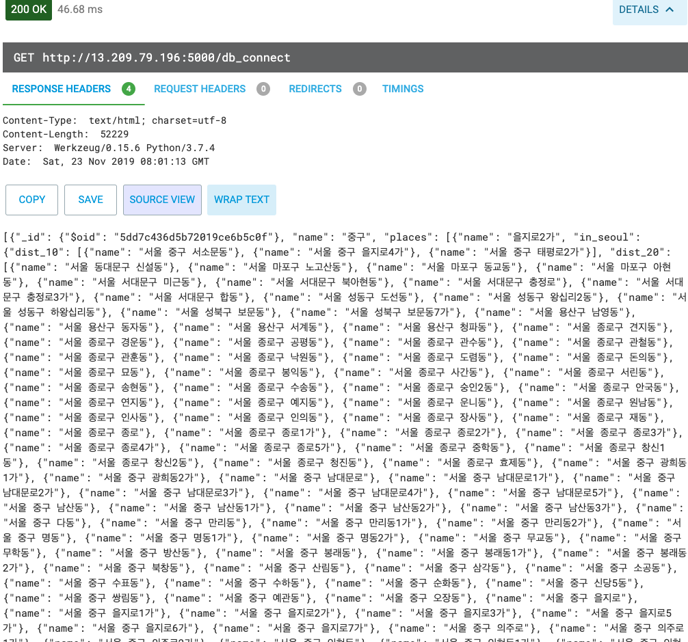
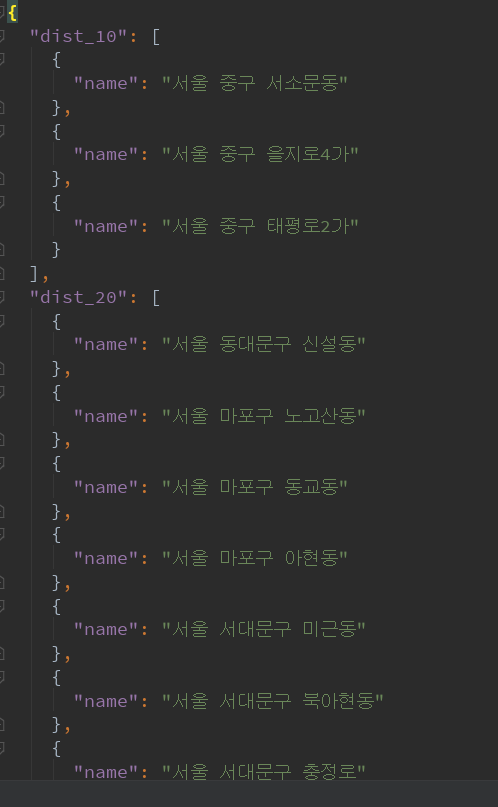
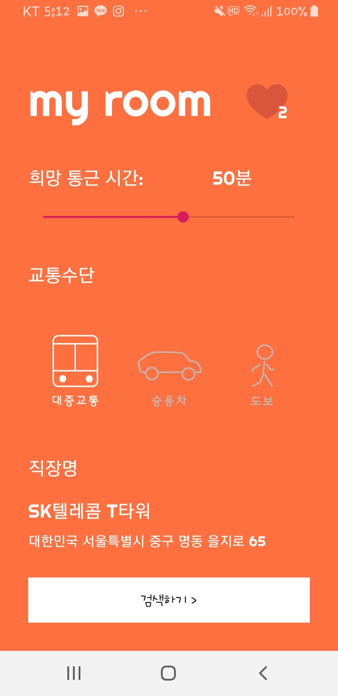
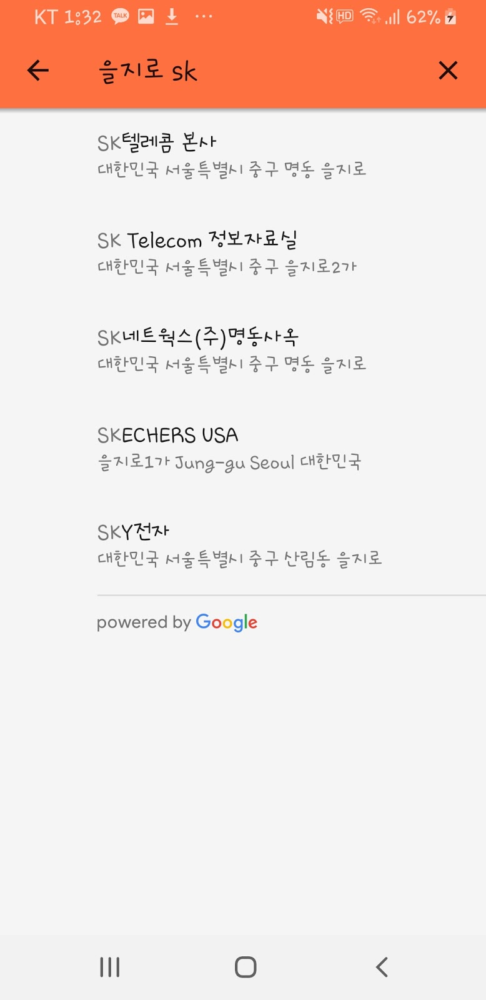
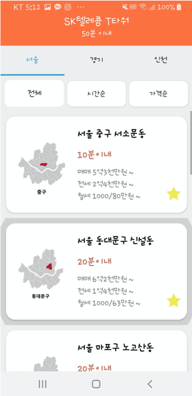
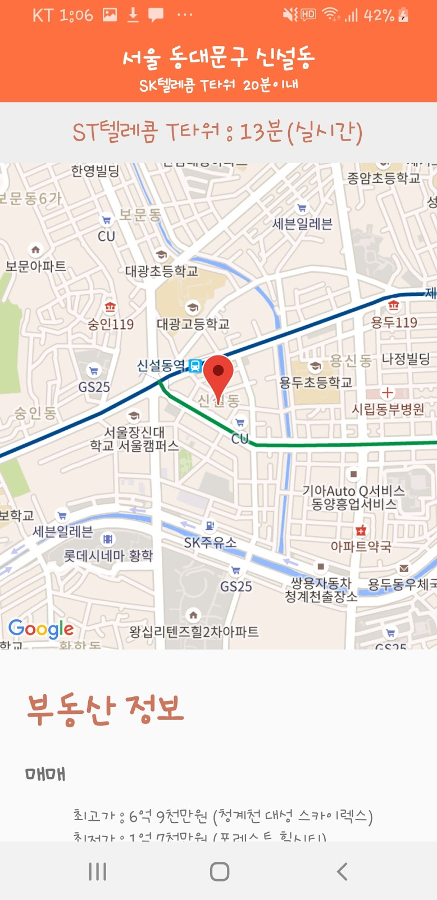

# 출발지 찾기 API 구현과 부동산 추천 서비스 'MY ROOM'
## 1. 프로젝트 소개
- 사회 초년생의 경우 주거지를 고르는데 ‘비용’ 그리고 ‘회사까지의 거리’라는  
두 가지의 문제로 인해 어려움을 겪게 된다.
-  본 프로젝트는 회사까지의 거리를 기반으로 한 주거지를 추천해주고,  
해당 지역의 부동산 매물을 쉽고 빠르게 비교하기 위한 서비스를 개발하고자 하였다. 

## 2 - 1 출발지 찾기 API
- 기존의 길찾기  API의 경우 출발지와 도착지를 입력하면 여러 경로를 보여주는 기능이 구현되어 있다.  
그러나 직장과의 거리 기반 주거지 추천을 위해서는 도착지와 희망 통근시간을 지정하였을 때,   
희망 통근시간안에 도착지까지 이동할 수 있는 여러 출발지를 보여주는 '출발지 찾기 API'가 필요하였다.  
이를 위해, 기존에 존재하는 '카카오 로컬API'와 'Google Direction API'를 이용하여 데이터베이스를 구성하였다.
- 데이터베이스는 MongoDB를 사용하였다.  

screenshot
-----------

  
  

## 2 -2 부동산 추천 서비스 'my room'
- 구글 API를 활용하여 키워드 검색을 통해 도착지(직장)의 주소를 입력하고 통근 시간을 지정하게 되면   
추천 주거 지역이 표시된다.  
- 그림 2의 a, b, c는 이러한 어플리케이션의 동작 과정을 나타낸다.  
- 그림 2의 d는 선택된 동의 실시간 도착 정보와 지도, 부동산 정보가 표시된다.    
- 부동산 정보의 경우 매매, 전세, 월세의 최저 최고가가 표시된다.

screenshot
-----------

  
  

  
  

## 3. 한계점
- Google Direction API 요청 횟수 제한으로 인해 모든 지역에 대한  
  이동소요 시간 별 이동가능한 지역들을 저장할 수 없었다.  
  
- 기획단계에서는 직방, 다방 등 부동산 서비스의 매물들을 크롤링 할 수 있을 것이라 예상했지만,  
  크롤링이 불가능했다.  
  
- 네이버 부동산(구버전)이 유일하게 크롤링이 가능하여, 네이버 부동산(구)에서 부동산 매물 정보를 받아왔으나,  
  네이버 부동산(구)에는 올라와 있는 부동산 매물이 극히 적어, 실 사용은 힘들어보였다.
